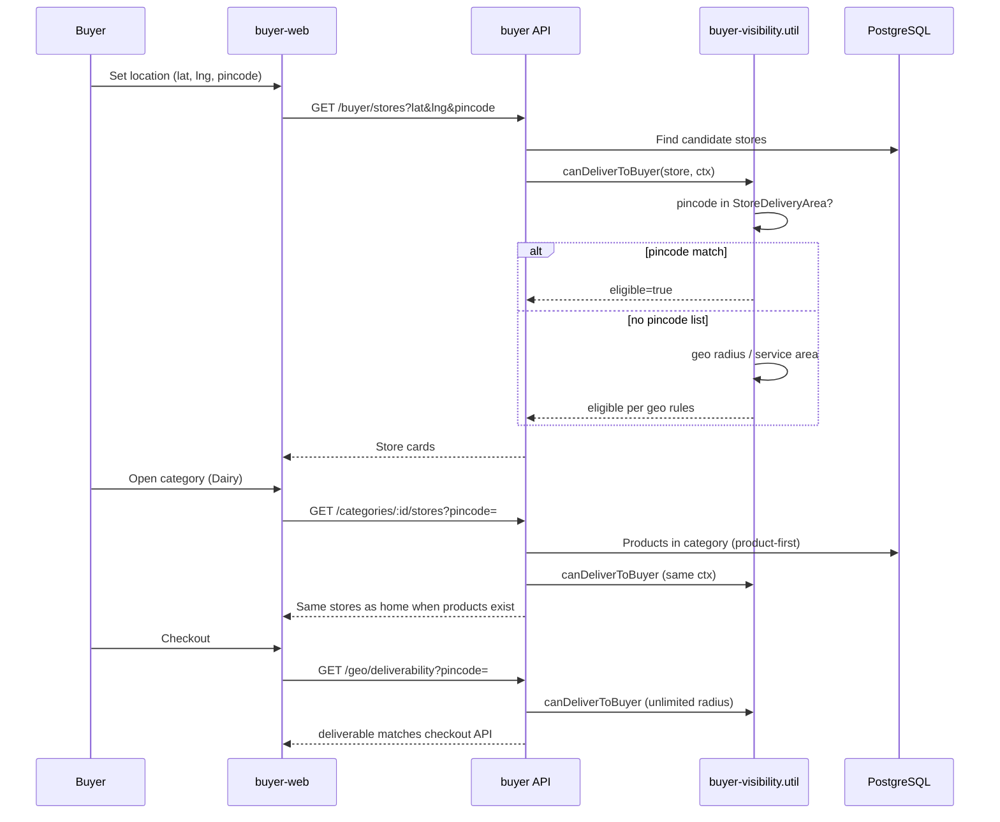

# Buyer visibility, discovery & delivery

Single source of truth: `buyer-visibility.util.ts` (+ injectable `BuyerVisibilityService`).

## Visibility rules

A **product** is buyer-visible when:

- `isActive = true`, `deletedAt = null`
- At least one active variant with `inventory.availableQty > 0` and `status = ACTIVE`
- `categoryId` points to an active global **leaf** (subcategory)

A **store** is buyer-visible when:

- `status = APPROVED`, `isActive = true`, `deletedAt = null`

Buyer category pages are **product-driven**: a store appears in a category because it sells visible in-stock products in that category — not because of a manual `StoreCategory` grant alone. (`StoreCategory` remains for merchant governance.)

## Delivery precedence

`canDeliverToBuyer()` delegates pincode logic to `checkStoreDeliverabilityWithCoverage()`:

1. **StoreDeliveryArea** — if the store has any active `store_delivery_areas` rows:
   - Buyer pincode in list → deliverable (distance is informational only)
   - Buyer pincode not in list → not deliverable
2. **Else geo** — store `deliveryRadiusKm` OR linked `ServiceArea` circles

Discovery endpoints also apply an optional **discovery radius** (default 20 km from client). Pincode match **bypasses** this cap (same as home).

Checkout / explicit deliverability checks use `UNLIMITED_DISCOVERY_RADIUS_KM` (no discovery cap).

## Flows

### Store discovery (home, search stores tab)

```
Buyer location (lat, lng, pincode?)
  → candidate stores (geo bbox + service areas + pincode index)
  → canDeliverToBuyer() per store
  → sort & paginate
```

### Category stores

```
Category id
  → resolve leaf category ids
  → product.groupBy (visible products in category)
  → load stores + deliveryAreas
  → canDeliverToBuyer()  (same as home)
```

### Product search

```
Text/category filters + PRODUCT_VISIBLE_WHERE
  → batch-load store geo (STORE_DISCOVERY_INCLUDE)
  → canDeliverToBuyer() per product's store
  → rank & paginate
```

### Checkout

```
Address (lat, lng, pincode)
  → DeliverabilityPanel → GET /buyer/geo/deliverability?pincode=
  → canDeliverToBuyer(UNLIMITED_DISCOVERY_RADIUS_KM)
  → checkout initiate → validateCheckoutLocation (same rules)
```

## Sequence diagram



## Merchant configuration

Merchants manage pincode delivery via **Settings → Delivery Coverage** (`StoreDeliveryArea`).

Changes invalidate buyer discovery cache (`buyer:stores:*`) immediately.

Do **not** rely on `ServiceArea.pincode` alone for buyer pincode delivery — use `store_delivery_areas`.

## Constants

| Constant | Value | Use |
|----------|-------|-----|
| `DEFAULT_BUYER_DISCOVERY_RADIUS_KM` | 20 | Home/search when client omits radius |
| `UNLIMITED_DISCOVERY_RADIUS_KM` | ∞ | Checkout deliverability checks |
